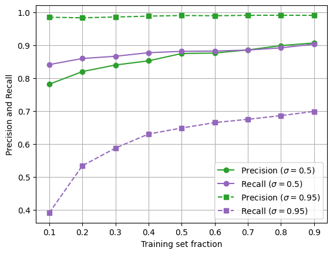
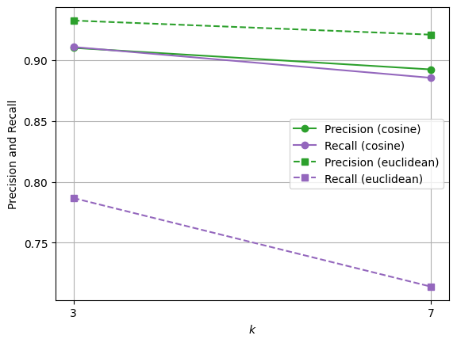
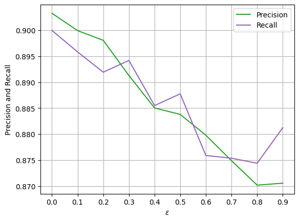
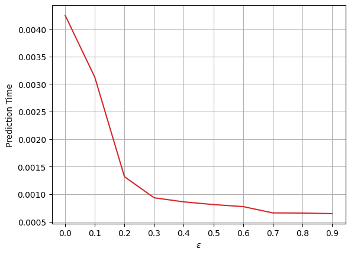
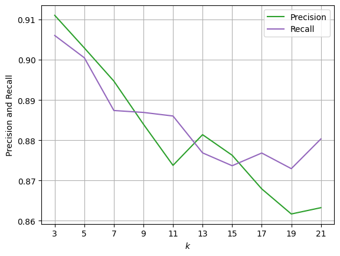
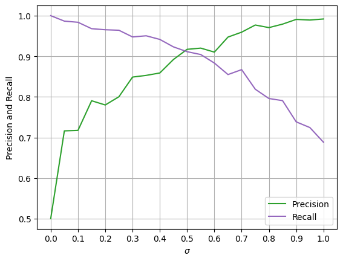

# FLAST parameters tuning

## Varying training set size

Other parameters: $\varepsilon=0.3$; $k=7$.

## Varying distance

Other parameters: $\varepsilon=0.3$; $\sigma=0.5$.

## Varying $\varepsilon$
Effectiveness             |  Efficiency
:-------------------------:|:-------------------------:
  |  

Other parameters: cosine distance; $k=7$; $\sigma=0.5$.

## Varying $k$

Other parameters: cosine distance; $\varepsilon=0.3$; $\sigma=0.5$.

## Varying $\sigma$

Other parameters: cosine distance; $k=7$; $\varepsilon=0.3$.
